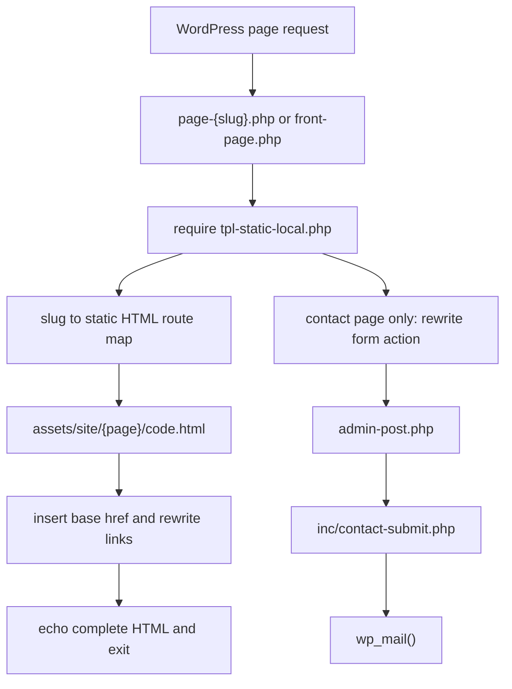

# ゆめハウスサイト現状評価レポート

## 1. This Report's Purpose

このレポートは、ゆめハウスサイトの現在の作りがどの程度「荒技」なのかを、感覚ではなくコードと表示確認の根拠から説明できるようにするためのメモです。後から Web ChatGPT などに渡して、WordPress 連携・保守性・UI 改善の観点で説明してもらえるように、事実と解釈を分けて残します。

## 2. User Request

ユーザーは「このサイトは私が作成したゆめハウスのサイトなのですが、かなり荒技ですよね」と質問した。求めているのは、現在の実装を無理に擁護することではなく、WordPress/Astra 上の作りとして正直にどう見えるかの評価。

## 3. Context

対象フォルダは `/Users/shiroto/Desktop/Blooo/Stitch_Web/Astra本番0205`。主な実体は `astra-child_0204` で、Astra 子テーマとして作られている。ただし通常の WordPress テーマのように `get_header()` / `get_footer()` / `the_content()` を中心にページを組むのではなく、`assets/site/` に置いた静的 HTML を PHP テンプレートから読み込んで返す構成。

## 4. Before / After Experience

今回はコード変更はしていない。

現状の体験として、デスクトップ表示ではトップページの見た目は成立している。店舗写真、ロゴ、主要 CTA、ページ一覧などは表示される。一方で、モバイル初期表示では店舗写真が大きく出て、ファーストビュー内で主コピーがすぐ見えにくい状態だった。

## 5. Software Engineering Breakdown

現在の実装は「WordPress を CMS として使う」というより、「WordPress を URL とメール送信の箱として使い、実際の画面は静的 HTML をそのまま配信する」方式。

荒技といえる理由は、以下の通り。

- `tpl-static-local.php` がスラッグごとの静的 HTML ルート表を持ち、HTML ファイルを直接 `file_get_contents()` で読み込んでいる。
- Astra の通常構造を使わず、`get_header()` / `get_footer()` / `wp_head()` / `wp_footer()` を呼ばない前提になっている。
- `page-home.php` や `page-contact.php` などのページテンプレートは、実質 `tpl-static-local.php` を `require` するだけの薄い入口になっている。
- 静的 HTML 側にヘッダー、フッター、ナビ、CTA、スクリプトがページごとに重複している。
- ページ間リンクや問い合わせフォームは、PHP 側の正規表現的な差し替えで WordPress に寄せている。
- 全ページで `https://cdn.tailwindcss.com` を読み込んでおり、ブラウザ確認で本番利用非推奨の警告が出た。

ただし、完全に悪い作りではない。短期間で「ローカルの見た目を WordPress 上に出す」目的には合理性がある。問い合わせフォームだけは `admin-post.php`、nonce、honeypot、`wp_mail()` を使っており、WordPress 側との接続点として再利用できる。

## 6. Implementation Overview

変更はなし。調査として以下を確認した。

- `astra-child_0204/tpl-static-local.php`
- `astra-child_0204/functions.php`
- `astra-child_0204/inc/contact-submit.php`
- `astra-child_0204/README.md`
- `astra-child_0204/assets/site/1._home/code.html`
- `astra-child_0204/assets/site/8._contact/code.html`

## 7. Key Files

- `astra-child_0204/tpl-static-local.php`: 静的 HTML を WordPress URL に紐づけて返す中心ファイル。
- `astra-child_0204/functions.php`: 子テーマ CSS の enqueue と問い合わせ処理ファイルの読み込み。
- `astra-child_0204/inc/contact-submit.php`: 問い合わせフォームを `admin-post.php` で受け、`wp_mail()` で送信する処理。
- `astra-child_0204/page-*.php`: 各ページスラッグから `tpl-static-local.php` を呼ぶ入口。
- `astra-child_0204/assets/site/*/code.html`: 実際の各ページ HTML。
- `astra-child_0204/assets/site/shared/base.css`: 共通 CSS。

## 8. Data Flow



## 9. Design Decisions

現在の方式は、初期移植としては速い。Astra や WordPress の CSS 干渉を避け、ローカル HTML の見た目を壊さずに出せるから。

一方で、長期運用では弱い。共通部品が HTML に散らばるため、ヘッダーやフッターを直すだけでも全ページ修正になりやすい。WordPress 管理画面で文章や導線を更新する余地も小さい。今後は、静的 HTML を「完成品」ではなく「デザイン素材」と見て、ホーム・問い合わせ・会社情報など価値の高いページから WordPress 側の自然な構造へ寄せるのがよい。

## 10. Restoration Facts Log

- `astra-child_0204` は 177MB、`assets/site` も 177MB。
- `astra-child_0204.zip` は 161MB。
- `assets/site` 配下には 99 ファイル、24 ディレクトリ。
- `code.html` は 11 ページ分あり、合計でかなり大きい。トップページだけで 2417 行。
- `cdn.tailwindcss.com` の読み込みは 11 箇所。
- `href="#"` は 23 箇所。
- Googleusercontent の `aida-public` 画像参照は 13 箇所。
- `header` / `footer` / `mobile-menu` / `portal-fab` / `cta-band` / `nav-more` など共通 UI らしき記述は検索上 593 箇所。
- PHP 構文チェックは全 PHP ファイルで通過。
- Git 状態には既存の削除ファイル 1 件と `Html_Copy/` の未追跡があった。今回の調査では触っていない。

## 11. Verification

実行した確認:

- `git status --short`
- `php -l` on all PHP files under `astra-child_0204`
- `python3 -m http.server 8123` from `astra-child_0204/assets/site`
- Browser で `http://127.0.0.1:8123/1._home/code.html` を表示確認
- デスクトップ 1280x720 のスクリーンショット確認
- モバイル 390x844 のスクリーンショット確認
- Console warning/error 確認

結果:

- PHP 構文エラーなし。
- デスクトップ表示は成立。
- モバイル初期表示では主コピーより写真が強く、ファーストビュー設計に改善余地あり。
- Console に Tailwind CDN の production warning が出た。致命的エラーではないが、本番品質としては直したい。

## 12. What Can Be Learned

この実装から学べることは、「動く」と「保守しやすい」は別だという点。静的 HTML を WordPress で返す方法は、移植や緊急公開には有効だが、CMS らしい更新性や共通部品の保守性は弱い。

一方、問い合わせフォームの `admin-post.php` 連携は、WordPress と正しく接続できている良い部分。今後の改修では、このような既存の良い接続点を残しつつ、ヘッダー、フッター、CTA、ページデータを少しずつ WordPress/PHP 側へ寄せるのが安全。

## 13. Web ChatGPT Explanation Prompt

```text
以下の実装レポートをもとに、このゆめハウスサイトの現状実装を Software Engineering 的にかなり丁寧に解説してください。

目的は、Codex の調査結果を blackbox にせず、何が「荒技」なのか、なぜ短期的には成立するのか、どこから改善すると保守しやすい WordPress サイトになるのかを理解することです。

初心者にもわかるように、ただし内容は薄くせず、具体的なファイル名・関数名・データフローを使って説明してください。

特に、静的 HTML 配信ブリッジ、Astra を通常利用していない点、問い合わせフォームだけは WordPress 連携できている点、今後の安全な改善順序をわかりやすく説明してください。

説明の構成や順番は、読み手が一番理解しやすい形に任せます。
```

## 14. Risks and Next Steps

次にやるなら、いきなり全面作り直しではなく、以下の順が安全。

1. 現在の `assets/site` を素材として扱い、正本フォルダを 1 つに決める。
2. `cdn.tailwindcss.com` をやめ、ビルド済み CSS または整理された共通 CSS に寄せる。
3. ヘッダー、フッター、CTA、ナビを共通 PHP パーツ化する。
4. ホームと問い合わせだけを先に WordPress らしい構造へ寄せる。
5. 物件導線や会社情報など、更新頻度の高い部分から管理画面で扱える形にする。

