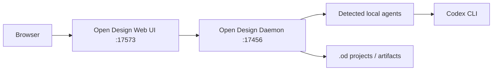

# Open Design Install Report

## 1. This Report's Purpose

このメモは、Open Design をローカルで使える状態にした作業を black box にしないための記録です。後で Web ChatGPT や別セッションに渡しても、どこに入れたか、なぜ通常手順から少し変えたか、どう起動するかを復元できるようにします。

## 2. User Request

ユーザーは、X の投稿で見た Open Design について「これ入れれる？」と質問した。目的は、Astra サイト改善のデザイン案作成・プロトタイプ確認に Open Design を試せる状態にすること。

## 3. Context

作業開始時のカレントフォルダは `/Users/shiroto/Desktop/Blooo/Stitch_Web/Astra本番0205`。Astra 本体には未追跡ファイルや削除扱いのファイルがあったため、本体リポジトリを汚さないよう、Open Design は隣の専用フォルダ `/Users/shiroto/Desktop/Blooo/Stitch_Web/open-design` に入れた。

## 4. Before / After Experience

Before: Open Design は未導入で、使うには公式リポジトリ取得、Node/pnpm セットアップ、dev server 起動が必要だった。

After: `/Users/shiroto/Desktop/Blooo/Stitch_Web/open-design` に展開済みで、`http://127.0.0.1:17573/` から Web UI を開ける。Codex CLI も Open Design 側の `/api/agents` で検出済み。

## 5. Software Engineering Breakdown

- user experience problem: デザイン案作成ツールを、Astra 本体を壊さずローカルで試したい。
- existing flow reused: Open Design 公式の `pnpm tools-dev run web` フローを使用。
- state/data flow: Web UI が Next.js 側、daemon が `127.0.0.1:17456`、UI が `127.0.0.1:17573` で動く。
- safety: Astra 本体には Open Design の依存関係を入れず、隣接フォルダに分離した。
- failure handling: Git clone と既存 Node での pnpm install が失敗したため、ZIP 展開とローカル Node 24.15.0 に切り替えた。

## 6. Implementation Overview

変更したこと:

- Open Design を `/Users/shiroto/Desktop/Blooo/Stitch_Web/open-design` に配置。
- 公式 Node 24 LTS `v24.15.0` を Open Design フォルダ内の `.local-node/` に配置。
- `pnpm install` をローカル Node 24.15.0 + `pnpm@10.33.2` で成功させた。
- 起動用の `start-open-design.sh` を Open Design 直下に追加。
- 最終的には `pnpm tools-dev start web --daemon-port 17456 --web-port 17573` でバックグラウンド起動に切り替えた。

変更していないこと:

- Astra 本体の UI/HTML/CSS/JS は触っていない。
- グローバル Node.js は更新していない。
- Astra の既存未追跡ファイルや削除扱いファイルは戻していない。

## 7. Key Files

- `/Users/shiroto/Desktop/Blooo/Stitch_Web/open-design`: Open Design 本体。
- `/Users/shiroto/Desktop/Blooo/Stitch_Web/open-design/.local-node/node-v24.15.0-darwin-arm64`: Open Design 用のローカル Node。
- `/Users/shiroto/Desktop/Blooo/Stitch_Web/open-design/start-open-design.sh`: 再起動用スクリプト。
- `/Users/shiroto/Desktop/Blooo/Stitch_Web/Astra本番0205/docs/codex-memos/2026-05-21-open-design-install.md`: この作業メモ。

## 8. Data Flow



## 9. Design Decisions

Open Design は Astra 本体の依存ではなく、デザイン検討用ツールなので、Astra の `package.json` や既存ビルドフローには混ぜなかった。Git clone は途中で `early EOF` になったため、実行用途では履歴が不要と判断し、GitHub ZIP を使った。Node 24.4.1 では pnpm 展開中に heap out of memory が出たため、グローバル環境を変えずに `.local-node` へ公式 Node 24.15.0 を入れた。

## 10. Restoration Facts Log

- 公式要件: Node `~24`, pnpm `10.33.x`。
- 手元の初期 Node: `v24.4.1`。
- 手元の初期 pnpm: `10.9.0`。
- Corepack 経由 pnpm: `10.33.2`。
- Git clone 失敗: `fetch-pack: unexpected disconnect while reading sideband packet`, `fatal: early EOF`。
- 代替取得: `https://github.com/nexu-io/open-design/archive/refs/heads/main.zip`。
- 通常 `pnpm install` 失敗: `FATAL ERROR: invalid array length Allocation failed - JavaScript heap out of memory`。
- `NODE_OPTIONS=--max-old-space-size=8192` や `--ignore-scripts` でも Node 24.4.1 では失敗。
- 解決: Open Design フォルダ内に Node `v24.15.0` を入れて、PATH を先頭にして `pnpm install`。
- install warning: `apps/packaged/node_modules/.bin/od` の bin 作成警告、`core-js`, `electron-winstaller`, `protobufjs`, `sharp` の build scripts approval warning が出た。Web UI と daemon 起動には支障なし。
- Open Design が検出した Codex: `/opt/homebrew/bin/codex`, `codex-cli 0.132.0`。

## 11. Verification

実行・確認したこと:

- `corepack pnpm --version` -> `10.33.2`。
- ローカル Node -> `v24.15.0`。
- `pnpm install` -> 成功。
- `pnpm tools-dev run web --daemon-port 17456 --web-port 17573` -> 起動成功。
- `pnpm tools-dev start web --daemon-port 17456 --web-port 17573` -> バックグラウンド起動成功。
- `curl -I http://127.0.0.1:17573/` -> `HTTP/1.1 200 OK`。
- `curl http://127.0.0.1:17456/api/health` -> `{"ok":true,"version":"0.7.0"}`。
- `curl http://127.0.0.1:17456/api/agents` -> Codex CLI available true を確認。
- 最終 status: daemon `running` on `http://127.0.0.1:17456`, web `running` on `http://127.0.0.1:17573`。

## 12. What Can Be Learned

今回のポイントは、外部ツールを既存プロジェクトへ直接混ぜず、隣接フォルダに分離して導入したこと。開発ツールの導入では、公式の happy path がローカル環境差で失敗することがあるため、原因を「取得方法」「依存インストール」「Node バージョン」に分けて切り分けると復旧しやすい。

## 13. Web ChatGPT Explanation Prompt

```text
以下の実装レポートをもとに、この Open Design 導入作業を Software Engineering 的にかなり丁寧に解説してください。

目的は、Codex の作業を blackbox にせず、何を、なぜ、どの既存構造を守って導入したのかを理解することです。

初心者にもわかるように、ただし内容は薄くせず、具体的なフォルダ名・コマンド・エラー・検証結果を使って説明してください。

特に、既存の Astra 本体を汚さない分離方針、Git clone 失敗時に ZIP へ切り替えた判断、グローバル Node を変えずローカル Node で解決した判断を説明してください。

説明の構成や順番は、読み手が一番理解しやすい形に任せます。
```

## 14. Risks and Next Steps

- Open Design は dev server として起動しているため、Mac 再起動後は再度起動が必要。
- Web UI は確認済みだが、実際に Codex へデザイン生成依頼を投げるフル生成テストは未実施。
- 次に試すなら、Astra の既存画面を参照しながら「ファーストビュー案を3案出す」用途がよい。
