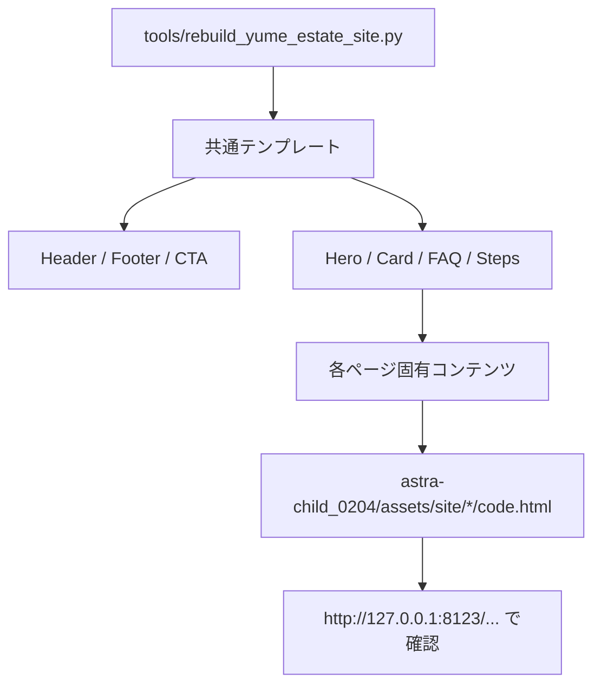

# Yume House Full Estate Site Rebuild Implementation Report

## 1. This Report's Purpose

このレポートは、今回のゆめハウス静的サイト刷新を black box にしないための記録です。あとで Web ChatGPT や別セッションに渡しても、何を、なぜ、どの既存構造に乗せて実装したのかを説明できるように、実装事実・設計判断・検証結果を残します。

## 2. User Request

ユーザーは、先に作ったトップページ中心の改善を「ダメすぎ」と判断し、参考サイトの不動産らしい見た目・導線を踏まえて、ゆめハウスの全ページを大幅に作り直したいと依頼しました。

重視点は次の通りです。

- 写真・文字・イラストのちゃちさをなくす
- 外部素材または AI 生成でもよいので、不動産サイトらしい街・住宅・室内系の画像を使う
- 参考サイトを真似てよい
- トップだけでなく全ページを整える
- ローカルで起動中の HTML として確認できる状態にする

## 3. Context

対象は `astra-child_0204/assets/site/` 配下の静的 HTML サイトです。WordPress 化の前段階として、各ページの `code.html` をまず静的 HTML として仕上げる方針にしました。

既存ページはフォルダごとに分かれていました。

- `1._home`
- `2._property_search`
- `3._property_details`
- `4._guide_flow`
- `5._our_strengths`
- `6._testimonials`
- `7._company_info`
- `8._contact`
- `9._rental_business`
- `10._faq`
- `11._privacy`

参考サイト分析では、物件導線、購入の流れ、会社情報、FAQ、問い合わせ導線が一貫して見えることが重要だと整理しました。一方で、古い jQuery 的な作りや画像文字見出し、過剰なバナー感は真似しない判断にしました。

## 4. Before / After Experience

Before:

- ページごとに印象がバラバラ
- 画像が弱く、住宅・不動産の実在感が出にくい
- トップ以外のページが古いまま残りやすい
- 物件を見る、相談する、購入の流れを読む、会社を確認する導線が弱い

After:

- 全11ページが同じヘッダー、ヒーロー、カード、CTA、フッターを共有
- 住宅外観、室内、店舗、街の写真を使い、不動産サイトらしい第一印象に変更
- 物件検索、物件詳細、購入の流れ、強み、相談事例、会社情報、問い合わせ、賃貸管理、FAQ、プライバシーまで役割を整理
- 内部リンクに `?v=20260521-estate3` を付け、ローカルブラウザの古いキャッシュを避けるようにした

## 5. Software Engineering Breakdown

問題は「デザインだけ」ではなく、ページ群の情報設計と保守性の問題でした。そこで、11個の HTML を直接手でばらばらに編集せず、`tools/rebuild_yume_estate_site.py` で共通テンプレートから再生成する構成にしました。

この判断の狙いは次です。

- ヘッダー、フッター、CTA、カード、FAQ、ステップ表示を全ページで統一する
- 文言や画像差し替えを Python スクリプト上で管理しやすくする
- WordPress 化するときも、共通パーツへ分解しやすい構造を残す
- 手作業で11ページを直してリンク崩れや表記ブレを増やさない

## 6. Implementation Overview

変更したこと:

- `tools/rebuild_yume_estate_site.py` を追加し、全11ページの HTML を生成
- `shared/base.css` に `estate-*` 系の共通スタイルを追加
- `estate-images/` に外部の住宅・室内・街系画像をローカル保存
- `estate-images/ATTRIBUTION.md` に画像ソースと利用メモを記録
- 各ページのヒーロー、セクション、カード、CTA、FAQ、フォームを不動産向けに再構成
- スマホ表示で日本語文が右端に詰まりすぎないよう、モバイル段落幅と折り返しを調整

変更しなかったこと:

- WordPress テーマ PHP への分解はまだしていない
- 問い合わせフォームの送信先は `action="#"` の静的状態
- 掲載物件データは実データ連携ではなく、表示型・サンプル型
- 既存の参考サイトミラーや過去メモは削除していない

## 7. Key Files

- `tools/rebuild_yume_estate_site.py`
  - 11ページ分の HTML を共通テンプレートで生成するスクリプト
- `astra-child_0204/assets/site/shared/base.css`
  - `estate-page`, `estate-header`, `estate-hero`, `estate-card`, `estate-grid`, `estate-faq`, `estate-form` などの共通CSS
- `astra-child_0204/assets/site/estate-images/`
  - 新しく取り込んだ外部画像の保存先
- `astra-child_0204/assets/site/estate-images/ATTRIBUTION.md`
  - 画像ソースとライセンス確認先の記録
- `astra-child_0204/assets/site/*/code.html`
  - スクリプトから再生成された全ページ

## 8. Data Flow



## 9. Design Decisions

大きな方針は、参考サイトの「不動産会社として見える構造」を取り入れつつ、古い実装感は避けることです。

採用したもの:

- 大きな住宅写真ヒーロー
- 物件を見る、相談する、購入の流れを見る、会社情報を見る、という明確な導線
- 物件カード、相談事例、FAQ、購入フロー、会社情報、CTA
- 実店舗写真と外部住宅写真の併用

避けたもの:

- 画像内テキストに依存した見出し
- バナーだらけの構成
- ページごとに別デザインを手作業で作ること
- 大きな JS 依存や複雑なビルド構成

## 10. Restoration Facts Log

- 生成スクリプトは `VERSION = "20260521-estate3"` を持つ
- CSS と内部ページリンクには `?v=20260521-estate3` を付与
- 電話番号は `096-383-2001`
- 住所は `〒862-0926 熊本県熊本市東区保田窪5-7-11`
- 外部ポータルリンクは SUUMO と at home
- 新規画像は `estate-images/` 配下に保存
- スマホの横はみ出し対策として `box-sizing: border-box`、ヒーロータイトルの行分割、段落の `overflow-wrap: anywhere`、モバイル段落幅制限を追加
- 生成HTMLの末尾空白は `render()` の `rstrip()` で除去
- 8123 のローカルサーバーは既存のまま利用

## 11. Verification

実行した確認:

- `python3 tools/rebuild_yume_estate_site.py`
  - 全11ページを書き出し
- HTML パース確認
  - 全11ページ `ok`
- 画像・CSS・内部リンク参照確認
  - `missing_count 0`
- HTTP確認
  - 全11ページ `200`
- `git diff --check`
  - 末尾空白エラーなし
- ブラウザ確認
  - ホーム、物件検索、問い合わせの3ページで `headerVisible: true`
  - 問い合わせページで `formVisible: true`
  - 主要3ページで `brokenImages: []`
  - 主要3ページで `overflowX: false`
  - CSS は `base.css?v=20260521-estate3`
- スクリーンショット確認
  - `/tmp/yumehouse-rebuild-final/home-desktop-v3.png`
  - `/tmp/yumehouse-rebuild-final/home-mobile-v5.png`
  - `/tmp/yumehouse-rebuild-final/search-mobile-v5.png`
  - `/tmp/yumehouse-rebuild-final/contact-desktop.png`

## 12. What Can Be Learned

今回の実装から学べる Software Engineering 的なポイントは、デザイン改善でも「共通化」と「検証」が重要だということです。

11ページを直接手で直すと、見た目は一時的に整っても、リンク切れ、余白差、文言ブレ、スマホ崩れが起きやすくなります。そこで共通生成スクリプトを作り、ページごとの役割だけを差し替える構造にしました。

また、見た目の改善は主観だけではなく、HTMLパース、参照切れ、HTTP 200、ブラウザでの画像切れ、横スクロール有無、スクリーンショットで確認しました。特にスマホでは、横スクロールがなくても文字が右端に詰まって見えるケースがあるため、スクリーンショット目視が必要でした。

## 13. Web ChatGPT Explanation Prompt

```text
以下の実装レポートをもとに、この実装を Software Engineering 的にかなり丁寧に解説してください。

目的は、Codex の実装を blackbox にせず、何を、なぜ、どの既存構造に乗せて実装したのかを理解することです。

初心者にもわかるように、ただし内容は薄くせず、具体的なファイル名・state・関数名・データフローを使って説明してください。

説明の構成や順番は、読み手が一番理解しやすい形に任せます。
重要だと思う観点があれば、レポートに書かれている範囲から補ってください。
```

## 14. Risks and Next Steps

残るリスク:

- 外部画像は雰囲気作り用の仮素材で、熊本の実景や実物件写真ではない
- 実際の物件データ、価格、月々支払いはサンプル表示
- フォーム送信処理は未実装
- WordPress 本番化では、HTMLを PHP テンプレート、固定ページ、カスタムフィールド、問い合わせプラグイン等へ分解する必要がある

次にやるとよいこと:

- 実店舗・熊本の街・実物件の写真に差し替える
- 物件カードを実掲載データに合わせる
- 問い合わせフォームの送信先を決める
- WordPress 化のために header/footer/CTA/card/FAQ をテンプレートパーツ化する
