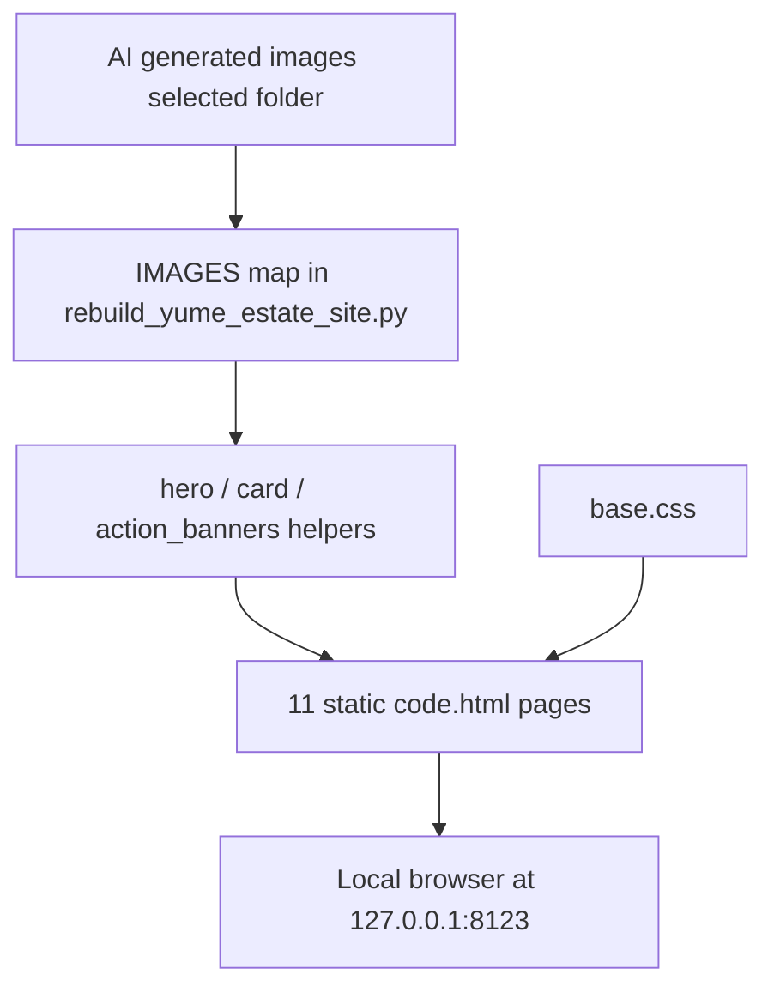

# ゆめハウス 生成画像入れ込み 実装レポート

## 1. このレポートの目的

このレポートは、ゆめハウスのHTMLサイトへAI生成画像を入れ込んだ作業を blackbox にしないための記録です。

後から Web ChatGPT や別セッションに渡しても、どの画像を、どの既存生成フローに乗せて、どう検証したかを復元できることを目的にしています。

## 2. ユーザーリクエスト

ユーザーは「まずは画像を徹底的に用意して！AI感のない画像を生成して」の次に、「では入れ込んでいって」と依頼した。

重視点:

- お手本サイトのように不動産会社らしく見せる
- 生成AI感の強い画像を避ける
- トップだけでなく、全ページに自然に画像を入れる
- HTMLでWordPress移植しやすい構造を保つ

## 3. コンテキスト

対象サイトは `astra-child_0204/assets/site/` 配下の静的HTML群。

全11ページは `tools/rebuild_yume_estate_site.py` で生成されているため、各HTMLを個別に直すのではなく、生成元スクリプトと共通CSSを更新した。

この方針により、今後の画像差し替えやコピー調整も同じスクリプトから再生成できる。

## 4. Before / After Experience

Before:

- トップヒーローやカードに外部素材・既存店舗写真が混在していた
- 画像の役割が弱く、物件・相談・地域感の見え方がややバラバラだった
- お手本サイトにある「地域景観ヒーロー」「横長CTAバナー」の印象がまだ薄かった

After:

- PCヒーローに `hero-desktop.jpg`、スマホヒーローに `hero-mobile.jpg` を使用
- トップ直下に売却・物件検索・ローン相談の横長CTAバナーを追加
- 物件カードに戸建て、マンション、土地、古家、道路、駐車場系の生成画像を反映
- 相談・ローン・会社/FAQ系にはオフィス相談、鍵、図面、ノートPC系の画像を使用
- 全ページのバージョンを `20260521-generated-images1` に更新

## 5. Software Engineering Breakdown

今回の問題は「画像を入れる」だけではなく、画像の役割を揃えることだった。

既存の安全な流れ:

1. `tools/rebuild_yume_estate_site.py` の `IMAGES` に画像キーを持つ
2. `card()`, `hero()`, `cta()` が画像キーを使ってHTMLを生成する
3. `base.css` が全ページ共通の見た目を管理する
4. `python3 tools/rebuild_yume_estate_site.py` で11ページを再出力する

この既存フローを再利用したため、各ページHTMLを手でバラバラに編集しなかった。

## 6. Implementation Overview

変更したこと:

- `IMAGES` の主要画像を `generated-20260521/selected/` の生成画像へ差し替え
- `hero()` に PC/スマホ別背景画像を渡せる `mobile_image` を追加
- ヒーロー背景を inline `background-image` からCSS変数方式へ変更
- `action_banners()` と `image_banner()` を追加
- トップ直下に売却・検索・ローン相談の横長バナー群を追加
- 物件カード、相談事例、賃貸管理、詳細ページの画像を用途に合わせて調整
- `base.css` に横長CTAバナー用CSSとスマホヒーロー切り替えCSSを追加
- `ATTRIBUTION.md` にAI生成画像セットの注記を追加

変更しなかったこと:

- ナビゲーション構造
- ページ数
- WordPress移植しやすい静的HTML構造
- SUUMO / at home の外部リンク
- 既存の店舗写真そのもの

## 7. Key Files

- `tools/rebuild_yume_estate_site.py`
  - 11ページの生成元。画像キー、ヒーロー、カード、CTAバナー構造を更新。

- `astra-child_0204/assets/site/shared/base.css`
  - 共通CSS。PC/スマホヒーロー出し分け、横長CTAバナーの見た目を追加。

- `astra-child_0204/assets/site/estate-images/generated-20260521/selected/`
  - 今回サイトに入れ込んだ選抜画像15枚。

- `astra-child_0204/assets/site/estate-images/ATTRIBUTION.md`
  - AI生成画像セットの注意書きを追加。

- `astra-child_0204/assets/site/*/code.html`
  - 生成後の全11ページHTML。

## 8. Data Flow



## 9. Design Decisions

生成画像をそのまま大量に貼るのではなく、役割別に使った。

- ヒーロー: 地域景観、青空、余白
- トップ直下: 売却・検索・ローン相談の横長導線
- 物件カード: 普通の戸建て、マンション、土地、道路、古家
- 相談系: 図面、鍵、ノートPC、相談風景
- 下層ヒーロー: 各ページの意味に近い背景画像

お手本サイトの強さは画像単体ではなく、画像の役割分担にあるため、この構造を優先した。

## 10. Restoration Facts Log

主な追加・変更:

- `VERSION = "20260521-generated-images1"`
- `hero()` に `mobile_image` と `position` を追加
- CSS変数:
  - `--estate-hero-image`
  - `--estate-hero-image-mobile`
  - `--estate-hero-position`
  - `--estate-banner-image`
- 追加関数:
  - `image_banner()`
  - `action_banners()`
- 追加CSS:
  - `.estate-section--banner`
  - `.estate-image-banners`
  - `.estate-image-banner`
  - `.estate-image-banner--wide`
  - `.estate-image-banner__content`
  - `.estate-image-banner__arrow`

主な採用画像:

- `hero-desktop.jpg`
- `hero-mobile.jpg`
- `banner-sale-consultation.jpg`
- `banner-property-search.jpg`
- `banner-loan-consultation.jpg`
- `property-used-house.jpg`
- `property-apartment.jpg`
- `property-vacant-land.jpg`
- `property-older-house.jpg`
- `consultation-office.jpg`
- `consultation-desk-close.jpg`
- `keys-and-floorplan.jpg`

## 11. Verification

実行したコマンド:

```bash
python3 tools/rebuild_yume_estate_site.py
```

結果:

- 全11ページを書き出し成功

```bash
curl -I --max-time 3 'http://127.0.0.1:8123/1._home/code.html?v=20260521-generated-images1'
```

結果:

- `HTTP/1.0 200 OK`

```bash
python3 -m py_compile tools/rebuild_yume_estate_site.py
```

結果:

- Python構文チェック成功

HTML参照チェック:

- 全ページの `src`, `href`, inline `url(...)` を確認
- missing asset: `0`

ブラウザ確認:

- Desktop: `http://127.0.0.1:8123/1._home/code.html?v=20260521-generated-images1`
- PCヒーロー背景: `hero-desktop.jpg`
- CTAバナー数: `3`
- スマホ幅 `390x900`
- スマホヒーロー背景: `hero-mobile.jpg`
- `scrollWidth = clientWidth = 390` で横スクロールなし

確認スクリーンショット:

- `/tmp/yume-image-integration/home-desktop.png`
- `/tmp/yume-image-integration/home-banners.png`
- `/tmp/yume-image-integration/home-mobile-top.png`

## 12. What Can Be Learned

この作業から学べること:

- 画像差し替えは、各HTMLを直接直すより、生成元の画像マップを直す方が安全
- 不動産サイトでは「きれいな写真」より「地域感・実在感・相談感」の役割分担が重要
- PCヒーローとスマホヒーローは同じ画像を無理に使わず、別画像または別トリミングにすると崩れにくい
- 横長CTAバナーは、カードUIより不動産会社サイトらしさを強く出せる
- 生成AI画像は、採用前に用途別に選抜し、AIっぽい破綻や過度な美化を避ける必要がある

## 13. Web ChatGPT Explanation Prompt

```text
以下の実装レポートをもとに、この実装を Software Engineering 的にかなり丁寧に解説してください。

目的は、Codex の実装を blackbox にせず、何を、なぜ、どの既存構造に乗せて実装したのかを理解することです。

初心者にもわかるように、ただし内容は薄くせず、具体的なファイル名・state・関数名・データフローを使って説明してください。

特に、画像を各HTMLに直接貼らず `tools/rebuild_yume_estate_site.py` の生成フローに乗せた理由、`IMAGES` マップ・`hero()`・`action_banners()`・`base.css` の役割、PC/スマホでヒーロー画像を分ける設計を説明してください。

説明の構成や順番は、読み手が一番理解しやすい形に任せます。
重要だと思う観点があれば、レポートに書かれている範囲から補ってください。
```

## 14. Risks and Next Steps

残るリスク:

- AI生成画像は、細部に不自然な建築・道路・窓・人物が残る可能性がある
- 物件写真は実物件ではないため、本番では実物件画像に差し替える必要がある
- 会社/店舗の信頼性は、最終的には実店舗・スタッフ・内観写真で補強する方が強い

次にやると良いこと:

- トップ全体をもう一度見て、文字量・余白・CTA順をさらにお手本寄りに調整する
- 物件カード画像を本物の掲載物件写真に置き換える
- 店舗・スタッフ写真が用意できたら会社情報と相談ページに反映する
- WordPress/Astra 側へ移植する前に、HTML版で最終デザインを固める
