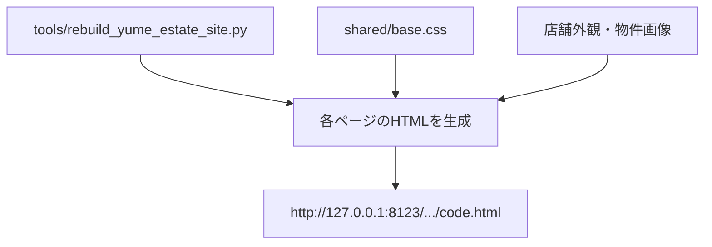

# ゆめハウス 生成AI感低減デザイン調整レポート

## 1. This Report's Purpose

このレポートは、今回のデザイン調整を blackbox にしないための記録です。あとから Web ChatGPT などに渡しても、何を変えたのか、なぜその判断をしたのか、どの既存構造に乗せたのかを追えるようにします。

## 2. User Request

ユーザーは、直前の `20260521-design-refresh2` を見て「まだまだ生成AI感が拭えないデザイン」と指摘した。

気にしていた点は、単に画像がAI生成かどうかではなく、サイト全体が「AIが作った不動産LP」っぽく見えることだった。具体的には、英字ラベル、黒いコピー帯、均一なカード、生成画像を背景に敷いた誘導バナー、制作メモのような本文が問題になっていた。

## 3. Context

対象は静的HTMLとして作っている、ゆめハウスの不動産サイト一式。

主な生成元は `tools/rebuild_yume_estate_site.py` で、全11ページの `code.html` を再生成する。共通の見た目は `astra-child_0204/assets/site/shared/base.css` に寄せている。

今回も既存方針どおり、WordPressへ移しやすい静的HTML/CSSの構成は維持した。新しい大きな依存や複雑なJSは追加していない。

## 4. Before / After Experience

Before:

- ホームヒーローが生成AI風の街並み画像で、汎用LPっぽく見えた
- ヒーローの説明文が黒い帯になっており、ややテンプレ広告のように見えた
- `Service` などの英字ラベルや、制作メモに近い本文が残っていた
- 上部の誘導バナーが生成画像を薄く敷いたデザインで、AI素材感が強かった
- カード、タグ、ボタンの見た目が均一で、少し作り物っぽかった

After:

- ホームヒーローを実店舗外観写真 `hero_storefront_front_sunny_cropped.jpg` に変更
- ヒーロー見出しを `熊本市東区で / 住まい探しの相談を。` に変更
- 黒い説明帯をやめ、写真上に自然に文字を重ねる形に変更
- 英字ラベルを日本語へ寄せ、`対応エリア`、`資金計画`、`相談範囲` などの実務的な表現に変更
- 誘導バナーは背景画像を使わず、白い導線パネルに変更
- 下層ページのコンパクトヒーローでは画像の主張を下げ、生成素材の粗が目立ちにくいようにした
- `お手本サイトのように`、`ページにします`、`大手風` など、実サイトに出すべきでない制作メモ調の文言を削除

## 5. Software Engineering Breakdown

今回の問題は「画像の問題」だけではなく、UIの語彙と構造の問題だった。

生成AI感を出していた要素:

- 抽象的な大見出し
- 生成画像を大きく背景に敷く構成
- 英字の小見出し
- 同じ形のカードが続くレイアウト
- 過度な影、角丸、ホバー演出
- 制作意図を説明するような本文

対応方針:

- 既存の `hero()`、`section()`、`card()`、`image_banner()` という生成関数は維持
- 変更はコピー、画像選択、共通CSSの範囲に限定
- 画像を増やすより、生成画像の露出を減らす方向にした
- 実店舗外観のような実在感のある素材を上部に使い、AI生成の街並み画像を主役から外した

## 6. Implementation Overview

変更したこと:

- `VERSION` を `20260521-humanized2` に更新
- ホームヒーロー画像を `store_crop` に変更
- CTA画像も生成オフィス画像から店舗外観へ変更
- ヒーローの高さ、文字幅、写真フィルター、説明文の背景処理を調整
- `.estate-image-banner::before` から背景画像表示を外し、白いパネル化
- テキストカード、タグ、ボタンの影と装飾を抑制
- 下層ページのコンパクトヒーロー画像を暗め・低彩度にして素材感を弱めた
- 制作メモ調の本文を顧客向けコピーに修正

変更しなかったこと:

- ページ構成そのもの
- 既存の静的HTML生成フロー
- SUUMO / at home への外部導線
- 問い合わせフォームの構造
- 物件カードの基本構造

## 7. Key Files

- `tools/rebuild_yume_estate_site.py`
  - 全11ページのHTML生成元。コピー、画像選択、バージョン番号、CTA画像を変更した。
- `astra-child_0204/assets/site/shared/base.css`
  - 共通デザイン。ヒーロー、カード、誘導バナー、タグ、ボタンの質感を調整した。
- `astra-child_0204/assets/site/*/code.html`
  - 再生成された全11ページ。
- `astra-child_0204/assets/site/image4/hero_storefront_front_sunny_cropped.jpg`
  - ホームヒーローとCTAに使う実店舗外観画像。

## 8. Data Flow



## 9. Design Decisions

一番大きな判断は、さらにAI画像を足すのではなく、AI画像の見せ場を減らしたこと。

理由:

- 大きい背景画像ほどAI感が出やすい
- 実在する店舗外観は、多少写真として粗くても信頼感が出る
- 不動産サイトでは、派手なビジュアルより「会社が存在する」「相談できる」「費用感が分かる」ことが重要
- 誘導バナーは写真よりも、白いパネルと明確な導線の方が業務サイトらしく見える

## 10. Restoration Facts Log

- `VERSION = "20260521-humanized2"`
- ホームヒーロー:
  - title: `熊本市東区で` / `住まい探しの相談を。`
  - lead: `物件、住宅ローン、校区、通勤、駐車台数まで。購入前の不安を一つずつ整理します。`
  - image: `store_crop`
- CTA画像:
  - `office` から `store_crop` に変更
- CSS:
  - `.estate-hero` min-height: `510px`
  - `.estate-hero--compact` min-height: `310px`
  - `.estate-hero--compact .estate-hero__image` を低彩度・暗めに調整
  - `.estate-hero__lead span` の黒背景を削除
  - `.estate-image-banner::before` は画像背景ではなく `background: #ffffff`
  - `.estate-image-banner::after` で左端のオレンジラインを追加
  - `.estate-card` と `.estate-button` の影を抑制
- 削除した制作メモ調表現:
  - `お手本サイトのように`
  - `ページにします`
  - `大手風`
  - `見栄えだけでなく`
  - `実在感を強めるため`
  - `実物件詳細ページの型です`

## 11. Verification

実行:

```bash
python3 tools/rebuild_yume_estate_site.py
python3 -m py_compile tools/rebuild_yume_estate_site.py
curl -I --max-time 3 'http://127.0.0.1:8123/1._home/code.html?v=20260521-humanized2'
```

結果:

- 全11ページ再生成成功
- Python構文チェック成功
- トップURLは `HTTP/1.0 200 OK`
- HTML参照チェック: missing `0`
- 制作メモ調文言の検索: 該当なし

ブラウザ確認:

- PC幅 `1280px`
  - `bodyMargin = 0px`
  - `scrollWidth = clientWidth = 1280`
  - ホームヒーロー背景: `hero_storefront_front_sunny_cropped.jpg`
  - 誘導バナー背景画像: `none`
- スマホ幅 `390px`
  - `scrollWidth = clientWidth = 390`
  - ヒーローテキスト中央寄せ
  - CTAボタン2件が縦並びで表示

スクリーンショット:

- `/tmp/yume-humanized2/home-top-1280.png`
- `/tmp/yume-humanized2/home-mid-1280.png`
- `/tmp/yume-humanized2/home-mobile-top.png`

## 12. What Can Be Learned

今回の学びは、WebサイトのAI感は「画像のAIっぽさ」だけで決まらないということ。

実務サイトらしさは、以下の積み重ねで出る。

- 実在感のある写真を主役にする
- 英字飾りを減らす
- 制作意図ではなく顧客に必要な情報を書く
- 写真を飾りとして乱用しない
- 影、角丸、グラデーション、ホバーを抑える
- 導線を派手にせず、迷わず押せる形にする

## 13. Web ChatGPT Explanation Prompt

```text
以下の実装レポートをもとに、この実装を Software Engineering 的にかなり丁寧に解説してください。

目的は、Codex の実装を blackbox にせず、何を、なぜ、どの既存構造に乗せて実装したのかを理解することです。

初心者にもわかるように、ただし内容は薄くせず、具体的なファイル名・state・関数名・データフローを使って説明してください。

今回は特に、Webサイトの「生成AI感」を下げるために、画像そのものだけでなく、コピー、レイアウト、装飾、情報設計をどう調整したのかを説明してください。

説明の構成や順番は、読み手が一番理解しやすい形に任せます。
重要だと思う観点があれば、レポートに書かれている範囲から補ってください。
```

## 14. Risks and Next Steps

- 実店舗外観をトップに使ったため、写真の品質や色味は今後差し替える余地がある
- 物件カード画像はまだ仮素材なので、実物件写真が入るとさらに信頼感が上がる
- 下層ページは共通ヒーローでAI感を抑えたが、ページごとの個別デザインまではまだ詰めきっていない
- 会社情報、スタッフ紹介、実際の接客風景が入ると、さらに地域不動産会社らしくなる
