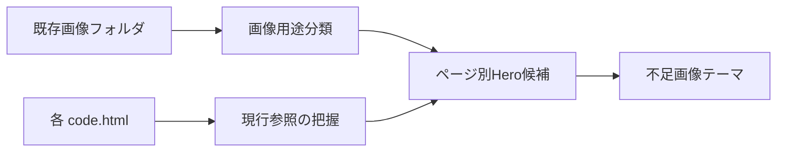

# ゆめハウス全ページ画像資産棚卸しメモ

## 1. This Report's Purpose

このメモは、ゆめハウス静的サイトを不動産サイトらしく見せるため、既存画像資産の用途を後から復元できる形で整理するためのもの。コード変更は行っていない。

## 2. User Request

ユーザーは `/Users/shiroto/Desktop/Blooo/Stitch_Web/Astra本番0205` で、次の画像資産と各 `code.html` の既存画像参照を見たうえで、全ページの見た目改善に使う画像候補を提案するよう依頼した。

- `astra-child_0204/assets/site/image2/`
- `astra-child_0204/assets/site/image3/store/`
- `astra-child_0204/assets/site/image4/`
- `astra-child_0204/assets/site/*/code.html` 内の既存画像参照

## 3. Context

現行の主対象は `astra-child_0204/assets/site`。ページは `1._home` から `11._privacy` まであり、現行HTML内にはローカル画像に加えて `lh3.googleusercontent.com/aida-public` の外部画像参照も残っている。

既存ページの役割は以下。

- `1._home`: トップ、物件検索、相談導線、強み、声、FAQ、会社情報
- `2._property_search`: SUUMO / at home への物件確認導線
- `3._property_details`: 物件詳細サンプル
- `4._guide_flow`: 住まい探しの流れ
- `5._our_strengths`: ゆめハウスの強み
- `6._testimonials`: お客様の声
- `7._company_info`: 会社情報
- `8._contact`: 問い合わせ
- `9._rental_business`: 賃貸斡旋・管理
- `10._faq`: FAQ
- `11._privacy`: プライバシーポリシー

## 4. Before / After Experience

現状は、実店舗写真・住宅写真・抽象背景・ロゴ・外部仮画像が混在している。特に下層ページのHeroに `image2/image*.png` の淡い抽象背景が多く、不動産会社の実在感や物件感が弱い。

改善方針は、HeroとCTAには実店舗・住宅街・内観・相談風景を置き、ロゴやQRは機能部品として限定使用すること。抽象背景は主役にせず、補助背景に留める。

## 5. Software Engineering Breakdown

今回の作業は実装ではなく素材選定の設計。小さく安全な方針は、既存ファイル名と既存HTMLの参照関係を変えずに、どの画像カテゴリをどのページに寄せるべきかを決めること。

重要な分解は以下。

- 信頼形成: 実店舗、店舗内観、駐車場、宅建免許、ロゴ
- 物件感: リビング、キッチン、住宅街、外観、庭
- 相談感: 受付、打ち合わせ、書類、鍵渡し
- 導線: SUUMO / at home ロゴ、QR、タイル画像
- 使いすぎ注意: 抽象背景、素材感の強いAI画像、外部仮画像

## 6. Implementation Overview

コード変更はなし。以下を確認した。

- 指定3フォルダの画像一覧とサイズ
- 画像のサムネイル一覧
- `astra-child_0204/assets/site/*/code.html` のローカル画像参照と外部画像参照
- 既存の `screen.png` によるページ外観

## 7. Key Files

- `astra-child_0204/assets/site/image2/`: 住宅・相談・生活感素材、一部抽象背景
- `astra-child_0204/assets/site/image3/store/`: 店舗内観、駐車場の実写真
- `astra-child_0204/assets/site/image4/`: 店舗外観、ロゴ、ポータルロゴ、QR、導線タイル、FAQ/相談画像
- `astra-child_0204/assets/site/*/code.html`: 各ページの現行画像参照

## 8. Data Flow



## 9. Design Decisions

不動産サイトらしさを出すには、きれいな抽象背景よりも「実在する会社」「相談できる場所」「住みたい生活」を見せる方が効く。したがって、`image3/store` と `image4/hero_storefront_*` は会社情報・問い合わせ・トップで優先し、`testimonial_*` と `strength_*` は生活感・事例・強みで使う。

`image2/image1.png` から `image2/image10.png` は淡い抽象背景で、ページの主役にすると不動産サイト感が弱い。補助背景としては使えるが、全ページHeroに使い回すべきではない。

## 10. Restoration Facts Log

確認した主要画像カテゴリ:

- 店舗外観: `image4/hero_storefront_front_sunny.jpg`, `image4/hero_storefront_front_sunny_cropped.jpg`, `image4/hero_storefront_front_sunny_cropped2.jpg`
- 店舗内観/駐車場: `image3/store/kumamoto_interior_evening.jpg`, `image3/store/kumamoto_interior_night.jpg`, `image3/store/kumamoto_parking2.jpg`
- 相談/流れ: `image2/guide_process_1.png` から `guide_process_5.png`
- 強み: `image2/strength_1.png`, `strength_2.png`, `strength_3.png`
- 事例/生活感: `image2/testimonial_living.png`, `testimonial_kitchen.png`, `testimonial_sunny_living.png`, `testimonial_garden.png`, `testimonial_street.png`, `testimonial_desk.png`
- 導線タイル: `image4/tile_search.png`, `tile_guide.png`, `tile_strength.png`, `tile_voice.png`, `tile_faq.png`, `tile_company.png`
- ロゴ/ポータル: `image4/yumehouse_logo_*`, `portal_suumo_logo.jpg`, `portal_athome_logo.png`, `portal_*_qr.png`, `blooo_logo.png`
- その他: `image4/FAQ.png`, `image4/soudan.png`, `image4/takken.jpg`, `image2/帯サンプル1.png`

現行参照の目立つ点:

- トップは実店舗、生活感、強み、CTA用のローカル画像をすでに複数参照している。
- `4._guide_flow`, `6._testimonials`, `7._company_info`, `8._contact`, `10._faq` のHeroは抽象背景系の `image2/image*.png` を参照している。
- `3._property_details` には外部 `lh3.googleusercontent.com/aida-public` 画像が複数残っている。
- `2._property_search` の物件カードにも外部画像が残っている。
- `11._privacy` は本文ページなので大きなHero画像を入れる必要性は低い。

## 11. Verification

実行・確認したコマンド:

- `rg --files astra-child_0204/assets/site/image2 astra-child_0204/assets/site/image3/store astra-child_0204/assets/site/image4`
- `find ... -print0 | xargs -0 file`
- `python3` で指定画像のコンタクトシートを `/tmp/yume_asset_contact_sheets/` に作成して目視確認
- `python3` で `astra-child_0204/assets/site/*/code.html` の画像参照を抽出
- `git status --short`

注意:

- `git status` には既存の変更・未追跡ファイルがあったが、今回の調査ではコード変更はしていない。
- 作成したサムネイル一覧は `/tmp` 配下の調査用一時ファイル。

## 12. What Can Be Learned

画像選定では「きれいか」だけでなく、画像の役割を分けることが重要。会社の信頼には実店舗写真、物件訴求には住宅・内観、相談導線には人と書類、FAQには不安を下げる落ち着いた写真が向いている。

また、本番サイトでは外部仮画像を減らし、ローカル管理された画像か権利確認済み素材へ寄せる方が安全。

## 13. Web ChatGPT Explanation Prompt

```text
以下の実装レポートをもとに、この画像資産棚卸しを Software Engineering / Web制作 的にかなり丁寧に解説してください。

目的は、ゆめハウス静的サイトの画像選定を blackbox にせず、どの画像を、なぜ、どのページ・セクションに使うべきかを理解することです。

初心者にもわかるように、ただし内容は薄くせず、具体的なファイル名・ページ名・Hero・カード・CTA・FAQ・事例の使い分けを使って説明してください。

説明の構成や順番は、読み手が一番理解しやすい形に任せます。
重要だと思う観点があれば、レポートに書かれている範囲から補ってください。
```

## 14. Risks and Next Steps

- 物件詳細ページ用の実物件写真が不足している。
- 賃貸管理ページ用のオーナー/管理/巡回/空室対策写真が不足している。
- 店舗・スタッフ・相談風景は実写真を増やすと信頼感が上がる。
- 抽象背景とAIっぽい素材は使いすぎると不動産会社らしさが落ちる。
- 外部画像は本番前にローカル化または差し替えが必要。
