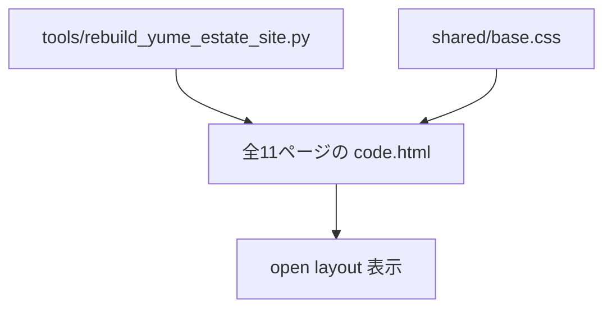

# ゆめハウス Open Layout 調整メモ

## 1. This Report's Purpose

このメモは、今回の「box感・AIデザイン感を下げる」調整を後から追えるようにするための記録です。外部の大きなデザインシステムを追加したのではなく、既存の静的HTML/CSS構造を維持したまま、囲い込みの多いUIを open layout 寄りに変更した。

## 2. User Request

ユーザーは `20260521-bluepalette1` を見て、まだ以下の違和感があると指摘した。

- box が多い
- あらゆる箇所がAIデザイン感に見える
- open design を導入するべきかもしれない

ここでの「open design」は、外部ライブラリ導入というより、情報を何でもカードで囲わず、余白・罫線・写真・見出しの流れで見せる方向として解釈した。

## 3. Context

対象は `tools/rebuild_yume_estate_site.py` から生成する全11ページの静的HTML。共通スタイルは `astra-child_0204/assets/site/shared/base.css`。

大きなHTML構造変更は避け、既存の `hero()`、`section()`、`card()`、`steps()`、`faq()` を維持した。今回は主にCSSの見え方を変える低リスクな変更にした。

## 4. Before / After Experience

Before:

- 誘導バナーが大きな白いboxとして見えていた
- テキストカードが全部boxに入っていた
- 物件カードも画像＋白いboxの反復に見えていた
- step、FAQ、table も囲われた部品に見え、AI生成LPっぽさが残っていた
- セクションごとに「カードを3枚置く」感じが強かった

After:

- テキストカードは白boxではなく、上罫線＋余白の情報ブロックに変更
- 物件カードは `estate-card--media` として、背景boxを消し、写真＋本文＋下罫線の掲載リスト風に変更
- 誘導バナーはboxをやめ、上罫線のリンク行に変更
- step は白boxをやめ、罫線付きの流れ表示に変更
- FAQ は囲みboxをやめ、アコーディオン行に変更
- CTAの紺色帯は維持し、問い合わせ導線は目立つように残した

## 5. Software Engineering Breakdown

問題は「各部品がカード化されすぎている」ことだった。

今回はHTMLの構造を壊さず、CSSで次のように役割を変えた。

- `estate-card--text`: card ではなく open information block
- `estate-card--media`: 物件・写真付き項目用の open media listing
- `estate-image-banner`: banner card ではなく link row
- `estate-step`: boxed step ではなく timeline-like row
- `estate-faq details`: boxed FAQ ではなく divider row

この方針にした理由:

- WordPress移植しやすい既存HTMLを維持できる
- 生成関数を大きく壊さずに全ページへ効く
- 外部依存を増やさない
- もし戻したい場合も CSS の差し替え中心で戻せる

## 6. Implementation Overview

変更したこと:

- `VERSION = "20260521-openlayout1"` に更新
- `card()` の画像ありカードに `estate-card--media` を付与
- `.estate-card` の border、background、radius を基本的に解除
- `.estate-card--text` を border-left box から border-top block に変更
- `.estate-card--media` を写真付き掲載リストとして、下罫線で区切る形に変更
- `.estate-image-banner` の box、背景、疑似背景を削除し、リンク行へ変更
- `.estate-step` の box背景を削除し、罫線行へ変更
- `.estate-step::before` は塗り丸から青線の丸へ変更
- `.estate-faq details` の boxを削除し、罫線行へ変更
- `.estate-table` の外枠boxを削除
- `.estate-band` の内側box感を削除し、紺色セクションの中に自然に置く形へ変更
- 狭いスマホ幅でもロゴとヒーロー見出しがはみ出しにくいように調整

変更しなかったこと:

- 全ページの情報構造
- URL構造
- SUUMO / at home への導線
- 問い合わせフォームの入力項目
- CTAのオレンジ色方針

## 7. Key Files

- `tools/rebuild_yume_estate_site.py`
  - バージョン更新と `estate-card--media` クラス付与。
- `astra-child_0204/assets/site/shared/base.css`
  - open layout 化の中心。カード、バナー、step、FAQ、table、CTA帯の見た目を変更。
- `astra-child_0204/assets/site/*/code.html`
  - 再生成された全11ページ。

## 8. Data Flow



## 9. Design Decisions

外部のデザインシステムを追加しなかった。

理由:

- 今の問題はコンポーネント不足ではなく、コンポーネントの見せ方が box に寄りすぎていること
- 外部ライブラリを足すと、WordPress移植時の制約が増える
- 静的HTML/CSSのままでも、罫線・余白・写真比率・情報密度を変えれば十分に印象は変えられる
- 不動産サイトでは、派手なUI部品より情報の読みやすさと実在感が重要

## 10. Restoration Facts Log

- `VERSION = "20260521-openlayout1"`
- `card()`:
  - imageあり: `estate-card estate-card--media`
  - imageなし: `estate-card estate-card--text`
- `.estate-card`:
  - `border: 0`
  - `border-radius: 0`
  - `background: transparent`
- `.estate-card--text`:
  - `border-top: 1px solid var(--estate-line)`
  - `padding: 22px 0 4px`
- `.estate-card--media`:
  - `border-bottom: 1px solid var(--estate-line)`
  - `padding-bottom: 22px`
- `.estate-image-banner`:
  - box border/background削除
  - `border-top: 1px solid var(--estate-line)`
- `.estate-step`:
  - box背景削除
  - `border-top: 1px solid var(--estate-line)`
- `.estate-faq details`:
  - box削除
  - `border-top` / 最終行 `border-bottom`
- `.estate-table`:
  - 外枠box削除
  - `border-top` のみ

## 11. Verification

実行:

```bash
python3 tools/rebuild_yume_estate_site.py
python3 -m py_compile tools/rebuild_yume_estate_site.py
curl -I --max-time 3 'http://127.0.0.1:8123/1._home/code.html?v=20260521-openlayout1'
```

結果:

- 全11ページ再生成成功
- Python構文チェック成功
- トップURLは `HTTP/1.0 200 OK`
- HTML参照チェック: missing `0`

ブラウザ確認:

- in-app browser PC相当表示:
  - `scrollWidth = clientWidth`
  - text card background: transparent
  - media card background: transparent
  - image banner background: transparent
  - step background: transparent
  - CTA button background: orange CTA
- 狭いスマホ相当表示:
  - `scrollWidth = clientWidth`
  - h1 right bound が viewport 内に収まることを確認
  - logo right bound が viewport 内に収まることを確認

ヘッドレスChrome確認:

- `1280 x 900` でトップ表示を保存
- `390 x 900` でスマホ表示を保存
- 途中で Chrome の既存Webアプリ関連 warning が出たが、スクリーンショット生成自体は成功

スクリーンショット:

- `/tmp/yume-openlayout1/home-top-1280.png`
- `/tmp/yume-openlayout1/home-mid-1280.png`
- `/tmp/yume-openlayout1/home-mobile-top.png`
- `/tmp/yume-openlayout1/chrome/home-top-1280.png`
- `/tmp/yume-openlayout1/chrome/home-mobile-390.png`

## 12. What Can Be Learned

AIっぽいWebデザインは、画像よりも「構成の癖」で出ることが多い。

特に以下はAI生成LPに見えやすい。

- すべてをカードで囲う
- 3列カードを何度も繰り返す
- 矢印付きboxを多用する
- 背景色の帯と白boxを交互に置く
- 部品の角丸と影が均一

今回のように、カードを減らして罫線・余白・本文量で整理すると、実務サイトらしさが出やすくなる。

## 13. Web ChatGPT Explanation Prompt

```text
以下の実装レポートをもとに、この実装を Software Engineering 的にかなり丁寧に解説してください。

目的は、Codex の実装を blackbox にせず、何を、なぜ、どの既存構造に乗せて実装したのかを理解することです。

初心者にもわかるように、ただし内容は薄くせず、具体的なファイル名・state・関数名・データフローを使って説明してください。

今回は特に、WebサイトのAIデザイン感を下げるために、box/card中心のUIを open layout に寄せた判断を説明してください。外部デザインシステムを追加せず、既存HTML生成構造と共通CSSだけで改善した点も重視してください。

説明の構成や順番は、読み手が一番理解しやすい形に任せます。
重要だと思う観点があれば、レポートに書かれている範囲から補ってください。
```

## 14. Risks and Next Steps

- boxを減らしたため、ページによっては情報のまとまりが弱く見える箇所が出る可能性がある
- 次はホームだけでなく、下層ページごとに個別の情報密度を調整するとさらに自然になる
- 特に問い合わせページは、フォームの安心感と open layout のバランスをもう一段詰める余地がある
- 実店舗・スタッフ・実物件写真が入ると、さらにAI感は下がる
