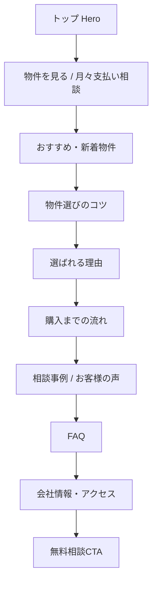

# ゆめハウス全ページ情報設計案メモ

## 1. This Report's Purpose

このメモは、参考サイト `reference-sites/jyuutakujyouhoukan-full-2026-05-21/www.jyuutakujyouhoukan.com/index.html` と既存分析メモをもとに、ゆめハウス静的サイト全ページへ「不動産ホームページらしさ」を落とすための情報設計案を残すもの。実装は行っていない。

## 2. User Request

ユーザーは、参考サイトの構成・見せ方をゆめハウス全ページに反映するため、トップページのセクション順、下層10ページの役割とコピー方針、参考サイトから真似る点・真似ない点を短く具体化することを依頼した。

## 3. Context

対象は `astra-child_0204/assets/site/*/code.html` の静的HTML群。トップページは、後半の実表示側で「熊本の住まい相談室」「月々支払いから物件を探す」「ローン・購入相談」へ寄せた構成を持つ。参考サイトは、新潟の不動産会社サイトとして、物件一覧、選び方、選ばれる理由、購入フロー、FAQ、会社/スタッフ、問い合わせを自然につないでいる。

## 4. Before / After Experience

現状は、ゆめハウスらしい「ローン相談」「月々支払い」「熊本生活圏」の訴求はあるが、参考サイトほどトップで物件・教育・信頼・CTAが順番に積み上がっていない。改修後は、最初に物件確認へ進め、その後に選び方、理由、流れ、FAQ、会社情報で不安を下げ、最後に相談へ戻る構成にする。

## 5. Software Engineering Breakdown

- ユーザー体験上の問題: 初回訪問者が「物件を見る」「買えるか相談する」「会社を信頼する」の順に理解しにくい。
- 既存構造の再利用: `2._property_search`, `4._guide_flow`, `5._our_strengths`, `6._testimonials`, `7._company_info`, `8._contact`, `9._rental_business`, `10._faq` の役割をそのまま活かす。
- 安全な方針: 新しいページ種別を増やすより、既存ページの役割を明確化し、Hero/主要セクション/CTAコピーをそろえる。

## 6. Implementation Overview

実装はしていない。提案方針は、参考サイトの情報順をコピーするのではなく、ゆめハウスの事業訴求に翻訳して適用すること。

## 7. Key Files

- `reference-sites/jyuutakujyouhoukan-full-2026-05-21/www.jyuutakujyouhoukan.com/index.html`: 参考サイトのトップ構成。
- `docs/codex-memos/2026-05-21-reference-site-analysis.md`: 参考サイトの強み・弱み・真似る点の整理。
- `astra-child_0204/assets/site/1._home/code.html`: ゆめハウストップ。
- `astra-child_0204/assets/site/2._property_search/code.html` から `11._privacy/code.html`: 下層10ページ。

## 8. Data Flow



## 9. Design Decisions

参考サイトで一番真似るべきは、デザイン部品よりも「物件を見せてから不安を潰す順番」。ゆめハウスでは「月々支払い」「住宅ローン」「校区」「駐車台数」「熊本の生活動線」をコピー軸にする。売却と賃貸管理はトップで入口を分け、購入導線と混ぜすぎない。

## 10. Restoration Facts Log

- 参考サイトトップは、売買物件検索/一覧、土地選びのコツ、選ばれる理由、購入までの流れ、FAQ、トピックス、会社/スタッフ、問い合わせCTAを持つ。
- ゆめハウス既存下層は、物件検索、物件詳細、案内の流れ、強み、お客様の声、会社情報、お問い合わせ、賃貸管理、FAQ、プライバシーの10ページ。
- トップの実表示側には `#kv`, `#service`, `#news`, `#recruit`, `cta-band` がある。
- 実装・コード変更・ブラウザ確認は行っていない。

## 11. Verification

実施:

- `rg --files` で対象ファイルを確認。
- 参考サイトトップの見出し・セクションを抽出。
- 既存 `code.html` 群の title / h1 / h2 / h3 / 主要CTAを抽出。
- 既存分析メモ `2026-05-21-reference-site-analysis.md` を確認。

未実施:

- コード変更。
- ブラウザ表示確認。
- ビルド/テスト。

## 12. What Can Be Learned

不動産サイトの情報設計では、会社紹介を先に語るより、物件・選び方・手順・FAQ・会社情報の順で不安を下げる方が自然。トップは「営業の名刺」ではなく「初回相談前の不安整理」として設計すると、各下層ページの役割も明確になる。

## 13. Web ChatGPT Explanation Prompt

```text
以下の実装レポートをもとに、この情報設計案を Software Engineering 的にかなり丁寧に解説してください。

目的は、Codex の提案を blackbox にせず、何を、なぜ、どの既存ページ構造に乗せて設計したのかを理解することです。

初心者にもわかるように、ただし内容は薄くせず、具体的なファイル名・ページ役割・CTA・データフローを使って説明してください。

説明の構成や順番は、読み手が一番理解しやすい形に任せます。
重要だと思う観点があれば、レポートに書かれている範囲から補ってください。
```

## 14. Risks and Next Steps

- 実装時は、トップに物件カードを置く場合、実データか外部ポータル誘導かを決める必要がある。
- `9._rental_business` は「準備中」と本コンテンツが混在しているため、正式ページ化するなら整理が必要。
- 参考サイトの古い実装、画像化テキスト、iframe依存、色数の多さは真似ない。
