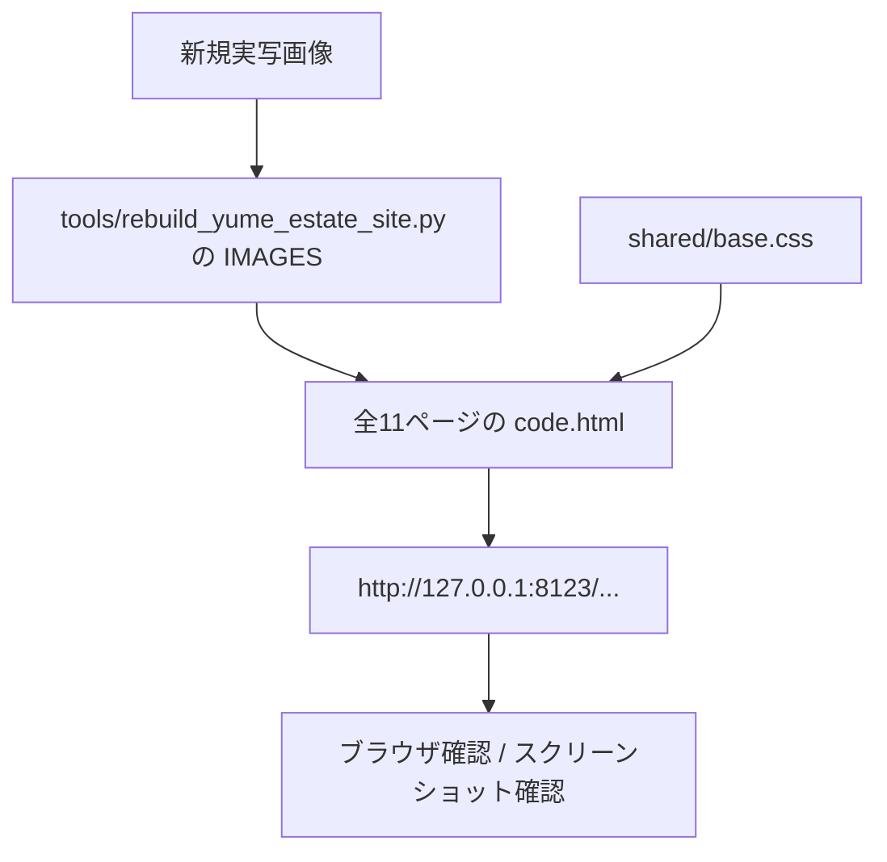

# Yume House Reference-Like Photo Tuning Implementation Report

## 1. This Report's Purpose

このレポートは、前回の全ページ不動産サイト化のあとに行った「生成AI感を消して、参考サイト寄りにする」追加調整を記録するものです。画像、配色、ヒーロー表現、モバイル崩れ対策、検証結果をあとから復元できるように残します。

## 2. User Request

ユーザーは次の2点を依頼しました。

- お手本サイトのように、生成AI感のない画像にする
- 画像以外の作り、色、雰囲気もお手本に近づける

## 3. Context

前回の刷新では、全11ページを `tools/rebuild_yume_estate_site.py` から生成する形にし、住宅外観や室内の外部素材を入れていました。ただし、ヒーロー画像がやや高級住宅CG・AI生成風に見え、参考サイトの「地域の実写写真」「白いヘッダー」「黒帯コピー」「オレンジ導線」とは違う印象が残っていました。

## 4. Before / After Experience

Before:

- 近代的な高級住宅写真が強く、実写でもAI生成のように見えやすい
- 全体が濃紺・高級住宅寄り
- CTAボタンが丸く、参考サイトの不動産ポータル風から少し遠い
- 参考サイトにある黒帯コピーやオレンジ導線が弱い

After:

- ホームヒーローを熊本市街の実写写真へ変更
- 物件検索・物件詳細を日本の住宅街の実写写真へ変更
- 相談・購入文脈に鍵の受け渡し写真を追加
- ヘッダーは白地、CTAはオレンジ、説明文は黒帯に変更
- 見出しは参考サイト寄りに、和文セリフ体の大きな白文字へ寄せた
- カードやフォームの角丸を小さくし、過度な高級感を抑えた

## 5. Software Engineering Breakdown

今回も各 HTML を直接編集せず、生成元の `tools/rebuild_yume_estate_site.py` と共通CSS `shared/base.css` を直しました。

理由は次の通りです。

- 11ページの画像差し替えを一箇所で管理できる
- CSS変更を全ページに同時反映できる
- WordPress 化するときも、生成元と共通パーツの対応が追いやすい
- ブラウザキャッシュ対策として `VERSION` を上げるだけで全ページのCSS更新を確実にできる

## 6. Implementation Overview

変更したこと:

- `VERSION` を `20260521-reference-photo3` に更新
- `IMAGES` の主要画像を、実写の熊本市街・日本の住宅街・鍵受け渡し写真へ変更
- ヒーロー本文を `<p>` から `.estate-hero__lead` の黒帯テキストへ変更
- Google Fonts に `Noto Serif JP` を追加
- CSSの色を青空系・白地・オレンジ導線へ変更
- ヒーロー見出しを和文セリフ体、中央配置、白文字へ変更
- CTAボタンを丸型から角丸小さめの矩形へ変更
- モバイルではヒーローCTAを縦積みにし、右切れを防止
- `ATTRIBUTION.md` に新規画像の出典とライセンス確認先を追記

## 7. Key Files

- `tools/rebuild_yume_estate_site.py`
  - 画像定義、ヒーローHTML、CSSバージョン、フォント読み込みを更新
- `astra-child_0204/assets/site/shared/base.css`
  - 色、ヒーロー、黒帯コピー、ボタン、カード、モバイルCTAを更新
- `astra-child_0204/assets/site/estate-images/`
  - 新規実写画像を追加
- `astra-child_0204/assets/site/estate-images/ATTRIBUTION.md`
  - Unsplash / Pexels の出典と利用メモを追記
- `astra-child_0204/assets/site/*/code.html`
  - 生成スクリプトから再生成された全11ページ

## 8. Data Flow



## 9. Design Decisions

参考サイトに寄せるうえで、直接コピーではなく「視覚文法」を合わせました。

取り入れた視覚文法:

- 地域の実写写真を大きく使う
- 白いヘッダー
- オレンジの問い合わせ導線
- 黒帯の説明コピー
- 和文セリフ体の大きなヒーロー見出し
- 角丸控えめの実務的なカード

避けたもの:

- 高級住宅CGのような写真
- AI生成風の過度に整った室内写真
- 濃紺グラデーション中心の高級感
- 著作権のある参考サイト画像の直接流用

## 10. Restoration Facts Log

- 追加画像:
  - `kumamoto-cityscape-unsplash.jpg`
  - `kumamoto-bridge-cityscape-unsplash.jpg`
  - `japan-residential-street-pexels.jpg`
  - `real-estate-keys-office-pexels.jpg`
- 現在の生成バージョン:
  - `VERSION = "20260521-reference-photo3"`
- ヒーロー本文:
  - `.estate-hero__lead span` で黒帯表示
- モバイルCTA:
  - `.estate-hero__buttons` を `display: grid` にして縦積み
- ライセンス確認先:
  - Unsplash Terms
  - Pexels License

## 11. Verification

実行した確認:

- `python3 tools/rebuild_yume_estate_site.py`
  - 全11ページを書き出し
- HTML パース確認
  - 全11ページ `ok`
- ローカル参照確認
  - `missing_count 0`
- HTTP確認
  - 全11ページ `200`
- `git diff --check`
  - 問題なし
- ブラウザ確認
  - ホーム、物件検索、問い合わせで画像切れなし
  - 横スクロールなし
  - CSS は `base.css?v=20260521-reference-photo2` から最終的に `base.css?v=20260521-reference-photo3` へ更新
- スクリーンショット確認
  - `/tmp/yumehouse-reference-photo/home-desktop-v3.png`
  - `/tmp/yumehouse-reference-photo/home-mobile-v3.png`
  - `/tmp/yumehouse-reference-photo/search-mobile-v3.png`

## 12. What Can Be Learned

「AIっぽさ」は画像だけでなく、全体の構成からも出ます。高解像度で整いすぎた住宅写真、濃いグラデーション、丸いSaaS風ボタン、抽象的なカードが重なると、実在する地域不動産会社よりも生成されたLPに見えやすくなります。

今回は、写真の選定、ヒーローコピーの黒帯、オレンジCTA、白ヘッダー、角丸控えめのカードという複数の要素を同時に調整しました。これにより、単に画像を差し替えるよりも、参考サイトに近い「実写の不動産会社感」に寄せられます。

## 13. Web ChatGPT Explanation Prompt

```text
以下の実装レポートをもとに、この追加調整を Software Engineering と Web Design の両面からかなり丁寧に解説してください。

目的は、Codex の実装を blackbox にせず、なぜ「生成AI感」が出ていたのか、どのファイルをどう直して参考サイトに近づけたのかを理解することです。

初心者にもわかるように、ただし内容は薄くせず、具体的なファイル名・CSSクラス・画像差し替え・データフローを使って説明してください。

説明の構成や順番は、読み手が一番理解しやすい形に任せます。
```

## 14. Risks and Next Steps

残るリスク:

- 外部素材は実写だが、完全な自社撮影ではない
- 住宅街写真は日本の街並みだが、熊本市東区の実景とは限らない
- 実物件写真はまだ不足している
- 本番公開時は、可能なら自社撮影の店舗、熊本の街、実物件、スタッフ相談風景へ差し替えるべき

次にやるとよいこと:

- 店舗外観、相談風景、熊本市東区の周辺道路、実物件外観の写真を撮影して差し替える
- トップ直下のカードを参考サイトのような大きなバナー型CTAに寄せる
- WordPress 化時に `estate-hero` / `estate-card` / `estate-cta` をテンプレートパーツ化する
