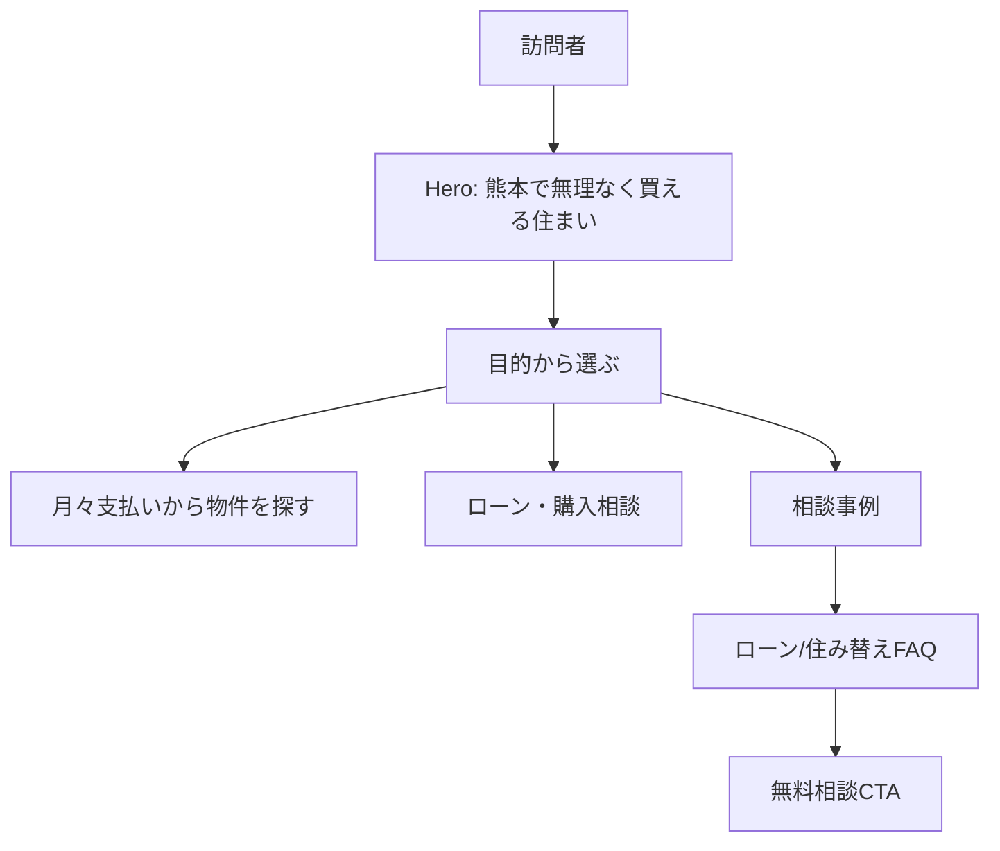

# ゆめハウス トップページ画像・コピー刷新 Implementation Report

## 1. This Report's Purpose

このレポートは、今回のトップページ刷新が black box にならないように、何を変えたか、なぜ変えたか、どの既存HTML/画像資産を使ったかを後から説明できるように残すためのものです。Web ChatGPT などに渡せば、Software Engineering 的な観点で実装意図を復元できる状態を目指します。

## 2. User Request

ユーザーは「夢ハウスの画像とか文字とかイラストなどを大幅に変えたい」と希望した。直前の議論では、参考サイトが視覚的に良く見える理由、ゆめハウスがちゃちく見える理由、外部素材やAI生成でも街中・自然・生活感のある画像を使う方向が話題になっていた。

## 3. Context

対象は静的HTMLとして起動しているトップページ `astra-child_0204/assets/site/1._home/code.html`。現在のローカル確認URLは `http://127.0.0.1:8123/1._home/code.html`。

既存サイトにはロゴ、店舗写真、生成系の住宅・相談シーン画像、各下層ページへのカード導線がすでにあった。今回は WordPress 化前のHTML仕上げ段階として、トップページの第一印象を変える範囲に絞った。

## 4. Before / After Experience

Before:

- Hero の主文言が「まずはお気軽にご相談ください。」で、何を相談できる不動産会社なのか弱かった。
- 導線セクションが「ページ一覧」で、サイトマップ感が強く、訪問者の目的に寄り添っていなかった。
- 相談事例が人物イラスト風で、実在感・生活感・不動産らしさが弱かった。
- FAQ/CTA は一般的な無料相談文言が中心で、ローン不安や住み替え不安に刺さりにくかった。

After:

- Hero を「熊本で、無理なく買える住まいを一緒に探す。」へ変更。
- Hero 背景を店舗写真、生活感のあるリビング、相談シーン、駐車場写真のスライドに変更。
- 導線セクションを「目的から選ぶ」に変更し、月々支払い、ローン相談、購入フロー、相談事例などに再整理。
- 相談事例カードの丸い人物イラストをやめ、庭付き戸建て、ローン相談、リビング写真へ変更。
- FAQ と下部CTAを「住宅ローンが不安」「買うか未定」「売却/賃貸管理も同時相談」へ寄せた。

## 5. Software Engineering Breakdown

今回の問題は、HTML構造そのものよりも「情報設計と素材選定」の問題だった。既存のカード構造、Tailwindクラス、画像配置の仕組みは使えるため、重いリデザインや新しい依存追加は不要だった。

小さく安全に変えるため、変更はトップページの可視メイン領域 `<main id="main">` とメタ情報に限定した。下層ページ、問い合わせフォーム、地図、共通ヘッダー/フッター、JSのスライダー制御には手を入れていない。

## 6. Implementation Overview

変更したこと:

- title / description / OG文言を熊本の住まい探し・住宅ローン相談向けに更新。
- Hero の背景画像4枚と見出し、リード、CTA文言を更新。
- Hero のテキスト配置を中央寄せから左寄せに変更し、より不動産サイトらしい第一印象にした。
- モバイルでH1とリードが見切れないよう、H1をspanで行分割し、リード文を短くした。
- 「ページ一覧」を「目的から選ぶ」に変更。
- 主要カードの画像、アイコン、見出し、説明、ボタン文言を更新。
- 相談事例カード3件の画像とコピーを、住宅購入/ローン/住み替え文脈に更新。
- FAQ と最下部CTAを住宅ローン・住み替え不安に寄せて更新。

変更しなかったこと:

- 下層ページの本文や画像。
- 問い合わせフォームの送信仕様。
- 共通ヘッダー/フッターの構造。
- Google Map iframe。
- WordPress テンプレート分解。

## 7. Key Files

- `astra-child_0204/assets/site/1._home/code.html`
  - 今回の変更対象。トップページのメタ情報、Hero、導線カード、相談事例、FAQ、CTAを更新した。
- `astra-child_0204/assets/site/image2/`
  - 生活感・相談シーンの既存画像を利用した。
- `astra-child_0204/assets/site/image3/store/`
  - 店舗・駐車場系の既存画像を利用した。
- `astra-child_0204/assets/site/image4/`
  - ロゴ、店舗外観、既存タイル素材を引き続き利用した。

## 8. Data Flow



## 9. Design Decisions

「夢」「理想」よりも「月々支払い」「校区」「駐車台数」「住宅ローン」という具体語を前に出した。理由は、不動産購入前のユーザーは抽象的なブランドコピーより、買えるかどうか、生活に合うかどうか、支払いが無理ないかを知りたいから。

画像は新規生成ではなく、まず既存資産から使えるものを選んだ。これにより、画像管理や著作権確認、ファイル配置の追加リスクを増やさず、短時間で第一印象を大きく変えられる。

相談事例は人物イラストから写真カードへ変更した。イラストは親しみやすいが、不動産サイトでは「実際の暮らし」「実際の相談」「実際の空間」を想像させる写真の方が信頼に繋がりやすい。

## 10. Restoration Facts Log

- Hero background:
  - `../image4/hero_storefront_front_sunny.jpg`
  - `../image2/testimonial_sunny_living.png`
  - `../image2/strength_1.png`
  - `../image3/store/kumamoto_parking2.jpg`
- Hero H1:
  - `熊本で、無理なく買える住まいを一緒に探す。`
- Hero lead:
  - `月々支払い・校区・駐車台数まで。`
  - `住宅ローンを整理してから物件を探せます。`
- Primary cards:
  - `月々支払いから物件を探す`
  - `ローン・購入相談をする`
- Case cards:
  - `../image2/testimonial_garden.png`
  - `../image2/testimonial_desk.png`
  - `../image2/testimonial_living.png`
- FAQ questions:
  - `住宅ローンが不安でも相談できますか？`
  - `まだ買うか決めていなくても大丈夫ですか？`
  - `売却や賃貸管理も同時に相談できますか？`
- Intentionally not touched:
  - `legacy-home` template body
  - 下層ページ
  - 共通JS
  - フォーム処理

## 11. Verification

実行した確認:

- `python3` の `HTMLParser` で `code.html` を読み込み、構文レベルで例外が出ないことを確認。
- `curl -s -o /dev/null -w '%{http_code}\n' http://127.0.0.1:8123/1._home/code.html` で `200` を確認。
- in-app Browser で `http://127.0.0.1:8123/1._home/code.html` を開き、title、H1、目的セクション、相談事例セクションが表示されることを確認。
- Browser DOM上で、読み込み済み画像の `naturalWidth/naturalHeight` が0のものがないことを確認。
- `git diff --check -- astra-child_0204/assets/site/1._home/code.html` で差分の空白エラーなしを確認。
- Chrome headless のモバイル幅スクリーンショットで、Hero のH1とリード文が見切れないように修正した。

注意:

- Browser の fullPage screenshot はページ下部の結合で重複表示が出たため、最終判断は in-app Browser の通常表示、DOM検査、Chrome headless のトップ/モバイル確認を組み合わせた。

## 12. What Can Be Learned

今回学べる点は、見た目の安っぽさはCSSだけでなく「誰に何を約束しているか」が曖昧な時にも出る、ということ。抽象コピーを具体的なユーザー不安に変えるだけで、同じHTML構造でもサイトの印象は大きく変わる。

また、リデザインでは全部を作り直すより、第一印象を決める Hero、主要導線、証拠になる事例、最後のCTAから変える方が安全で効果が出やすい。

## 13. Web ChatGPT Explanation Prompt

```text
以下の実装レポートをもとに、この実装を Software Engineering 的にかなり丁寧に解説してください。

目的は、Codex の実装を blackbox にせず、何を、なぜ、どの既存構造に乗せて実装したのかを理解することです。

初心者にもわかるように、ただし内容は薄くせず、具体的なファイル名・state・関数名・データフローを使って説明してください。

特に、なぜ「画像を変える」だけではなく「コピーと導線の意味」まで変えたのか、なぜ新しい依存を入れずに既存HTMLと既存画像資産で進めたのかを説明してください。

説明の構成や順番は、読み手が一番理解しやすい形に任せます。
重要だと思う観点があれば、レポートに書かれている範囲から補ってください。
```

## 14. Risks and Next Steps

- 今回はトップページ中心の第一弾で、下層ページのイラストやコピーはまだ残っている。
- 既存のAI生成系画像は一定改善になるが、最終的には熊本の街・実店舗・スタッフ・実物件写真を増やす方がさらに強い。
- 参考サイトのような信頼感を出すには、スタッフ紹介、会社の強み、購入フロー、FAQ、物件詳細側にも同じ文脈を展開する必要がある。
- WordPress 化する前に、トップページの最終構成を確定し、テンプレートパーツへ分解するのがよい。
